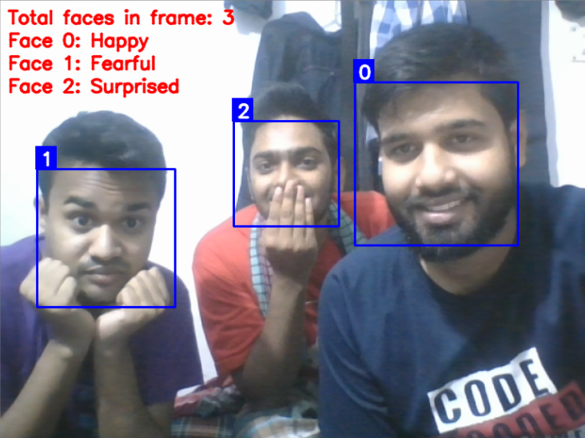

# emotion_detection_tensorflow_and_opencv
Emotion Detection with Multiple Faces.  
I use this repository to make [this](https://github.com/atulapra/Emotion-detection) project. your can find the data from this repository. I also upload my trained model. I make some changes for my need.

## Dependencies
* Python 3+, [OpenCV](https://opencv.org/), [Tensorflow](https://www.tensorflow.org/)

## Run
* I use jupyter notebook to implementaion this project. so you can easily run this project using jupyter notebook.
* You can use any other IDE as you want.

## Simple Image

